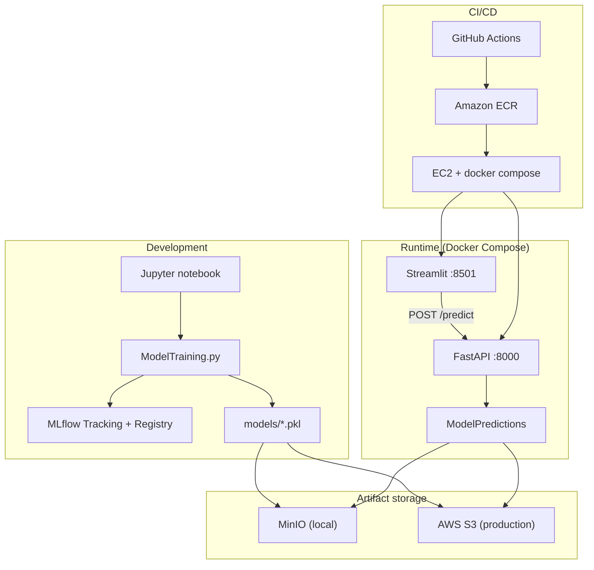

# Loan Approval MLOps Platform

End-to-end machine learning system for **loan approval classification**: train and compare models with **MLflow**, serve predictions via **FastAPI**, demo with **Streamlit**, and deploy to **AWS** with **Docker** and **GitHub Actions**.

---

## Table of contents

- [Overview](#overview)
- [Architecture](#architecture)
- [Tech stack](#tech-stack)
- [Project structure](#project-structure)
- [Prerequisites](#prerequisites)
- [Quick start (local development)](#quick-start-local-development)
- [Model training & experiment tracking](#model-training--experiment-tracking)
- [Model artifacts (S3 / MinIO)](#model-artifacts-s3--minio)
- [Run the full local stack (Docker)](#run-the-full-local-stack-docker)
- [Run services without Docker](#run-services-without-docker)
- [API reference](#api-reference)
- [Testing & code quality](#testing--code-quality)
- [CI/CD & production deployment](#cicd--production-deployment)
- [Environment variables](#environment-variables)
- [Troubleshooting](#troubleshooting)

---

## Overview

This project predicts whether a loan application is **Approved** or **Not Approved** using tabular features (income, CIBIL score, assets, education, etc.).

| Stage | What happens |
|--------|----------------|
| **Data** | CSV dataset (~4.2k rows) with preprocessing in `DataLoader` |
| **Training** | Logistic Regression vs Random Forest; metrics logged to **MLflow**; best model registered by **F1 score** |
| **Inference** | Same preprocessing for batch files and live API requests |
| **Serving** | **FastAPI** REST API + **Streamlit** UI |
| **Artifacts** | Models stored under date-versioned prefixes in **S3** (prod) or **MinIO** (local) |
| **Deploy** | GitHub Actions builds image → **ECR** → **EC2** via **SSM** |

---

## Architecture

### High-level system design



### Request flow (inference)

1. Client sends JSON to `POST /predict` (Streamlit or any HTTP client).
2. **FastAPI** validates input with **Pydantic** (`LoanApplication`).
3. **`ModelPredictions`** applies the same feature pipeline as training (`DataLoader.preprocess_data`).
4. The latest model is loaded from object storage (`models/YYYY-MM-DD/model.pkl`).
5. The API returns human-readable labels: `Approved` / `Not Approved`.

### Training flow

1. `DataLoader` loads `data/loan_approval_dataset.csv` and engineers features.
2. `ModelTraining` trains each candidate model (70/30 split, `random_state=42`).
3. **MLflow** logs parameters, accuracy / precision / recall / F1, and confusion-matrix plots.
4. The run with the highest **F1** is registered as `Loan_Approval_Prod_Model`.
5. Serialized models are saved under `models/` (e.g. `randomforestclassifier_loan_approval_model.pkl`).

---

## Tech stack

| Layer | Tools |
|--------|--------|
| **ML** | Python, pandas, numpy, scikit-learn, joblib |
| **Experiment tracking** | MLflow |
| **API** | FastAPI, uvicorn, Pydantic |
| **UI** | Streamlit, requests |
| **Cloud** | AWS S3, ECR, EC2, SSM; boto3 |
| **Local object storage** | MinIO (S3-compatible API) |
| **Containers** | Docker, Docker Compose |
| **Package manager** | [uv](https://github.com/astral-sh/uv) |
| **CI** | GitHub Actions, pytest, ruff, mypy |

---

## Project structure

```
mlopsbootcamp/
├── constants/
│   └── constants.py          # Paths, S3 prefix/filename
├── data/
│   ├── loan_approval_dataset.csv
│   └── test_data.csv
├── models/                   # Locally trained .pkl files
├── src/
│   ├── DataPreprocessing.py  # Shared train/inference preprocessing
│   ├── ModelTraining.py      # Train, evaluate, MLflow logging
│   ├── ModelPredictions.py   # Load model from S3/MinIO, predict
│   ├── fast_app/
│   │   └── fast_app.py       # FastAPI app
│   └── streamlit_app/
│       └── streamlit_app.py  # Demo UI
├── tests/
├── .github/workflows/
│   ├── ci.yaml               # Lint, typecheck, pytest
│   └── release-dev.yaml      # Build → ECR → deploy EC2
├── Dockerfile
├── docker-compose-local.yaml
├── docker-compose-prod.yaml
├── start_local.sh
├── loan-approval-model-1.ipynb
└── pyproject.toml
```

---

## Prerequisites

- **Python** 3.11+ recommended (matches `Dockerfile`; project supports 3.8+ per `pyproject.toml`)
- **[uv](https://docs.astral.sh/uv/getting-started/installation/)** for dependency management
- **Docker** & **Docker Compose** for the full local stack
- **AWS CLI** (optional) for uploading models to MinIO/S3

---

## Quick start (local development)

```bash
git clone <your-repo-url>
cd mlopsbootcamp

# Install dependencies
uv sync --frozen

# Run unit tests
uv run pytest

# Lint & typecheck (same as CI)
uv run ruff check .
uv run mypy
```

---

## Model training & experiment tracking

Train both models and log experiments to MLflow:

```bash
uv run python -m src.ModelTraining
```

This will:

- Train **LogisticRegression** and **RandomForestClassifier**
- Log metrics and a confusion-matrix image per run
- Register the best run (by **F1**) to the MLflow model registry as `Loan_Approval_Prod_Model`
- Save pickles under `models/` (e.g. `randomforestclassifier_loan_approval_model.pkl`)

View experiments locally:

```bash
uv run mlflow ui
```

Open [http://127.0.0.1:5000](http://127.0.0.1:5000) and select the `Loan_Approval_Experiment` experiment.

Exploratory work lives in `loan-approval-model-1.ipynb`.

### Feature engineering (training = inference)

| Step | Description |
|------|-------------|
| Target | `loan_status` → 1 (Approved) / 0 (otherwise) |
| Assets | Sum of residential, commercial, luxury, and bank assets → `total_assets_value` |
| Encoding | `education` (Graduate=1), `self_employed` (Yes=1) |
| Scaling | `log1p` on `income_annum`, `loan_amount`, `total_assets_value` |

---

## Model artifacts (S3 / MinIO)

The API does **not** read pickles from `models/` at runtime. It loads the **latest date-stamped** object from object storage:

```
s3://<S3_BUCKET_NAME>/models/YYYY-MM-DD/model.pkl
```

Constants (see `constants/constants.py`):

- Prefix: `models/`
- Filename: `model.pkl`

### Upload a model to MinIO (local)

1. Start MinIO (via Docker Compose below) or ensure it is running on port **9000**.
2. Create a bucket and upload your trained model (use today’s date folder):

```bash
export AWS_ACCESS_KEY_ID=minioadmin
export AWS_SECRET_ACCESS_KEY=minioadmin
export S3_BUCKET_NAME=mlopsbootcamp-models   # choose a bucket name

aws --endpoint-url http://localhost:9000 s3 mb "s3://${S3_BUCKET_NAME}" 2>/dev/null || true

DATE=$(date +%Y-%m-%d)
aws --endpoint-url http://localhost:9000 s3 cp \
  models/randomforestclassifier_loan_approval_model.pkl \
  "s3://${S3_BUCKET_NAME}/models/${DATE}/model.pkl"
```

For production, upload the same key layout to **AWS S3** (no `--endpoint-url`).

---

## Run the full local stack (Docker)

The local stack runs **MinIO**, **FastAPI**, and **Streamlit** together.

### 1. Set the bucket name for the API

`docker-compose-local.yaml` does not hard-code `S3_BUCKET_NAME`. Export it before starting (must match the bucket you created above):

```bash
export S3_BUCKET_NAME=mlopsbootcamp-models
```

To persist it, add under `loan-api-local` → `environment` in `docker-compose-local.yaml`:

```yaml
S3_BUCKET_NAME: mlopsbootcamp-models
```

### 2. Start everything

```bash
chmod +x start_local.sh
./start_local.sh
```

Or manually:

```bash
docker compose -f docker-compose-local.yaml up --build
```

### 3. Open the apps

| Service | URL |
|---------|-----|
| **Streamlit UI** | [http://localhost:8501](http://localhost:8501) |
| **FastAPI docs** | [http://localhost:8000/docs](http://localhost:8000/docs) |
| **MinIO console** | [http://localhost:9001](http://localhost:9001) (user/pass: `minioadmin`) |

Press `Ctrl+C` to stop; `start_local.sh` runs `docker compose down` on exit.

---

## Run services without Docker

Useful when iterating on Python code without rebuilding images.

**Terminal 1 — API** (requires model in MinIO/S3 and env vars):

```bash
export ENV_MODE=local
export S3_ENDPOINT_URL=http://localhost:9000
export AWS_ACCESS_KEY_ID=minioadmin
export AWS_SECRET_ACCESS_KEY=minioadmin
export S3_BUCKET_NAME=mlopsbootcamp-models

uv run uvicorn src.fast_app.fast_app:app --reload --host 127.0.0.1 --port 8000
```

**Terminal 2 — Streamlit**:

```bash
export BACKEND_API_URL=http://127.0.0.1:8000/predict
uv run streamlit run src/streamlit_app/streamlit_app.py
```

**Batch predictions** (file-based, after uploading model to storage):

```bash
export ENV_MODE=local
export S3_ENDPOINT_URL=http://localhost:9000
export AWS_ACCESS_KEY_ID=minioadmin
export AWS_SECRET_ACCESS_KEY=minioadmin
export S3_BUCKET_NAME=mlopsbootcamp-models

uv run python -m src.ModelPredictions
```

---

## API reference

### `POST /predict`

**Request body** (JSON):

```json
{
  "no_of_dependents": 2,
  "education": "Graduate",
  "self_employed": "Yes",
  "income_annum": 100000,
  "loan_amount": 20000,
  "loan_term": 12,
  "cibil_score": 700,
  "residential_assets_value": 1000,
  "commercial_assets_value": 2000,
  "luxury_assets_value": 3000,
  "bank_asset_value": 4000
}
```

**Response**:

```json
{
  "Your loan has been": ["Approved"]
}
```

**Example (curl)**:

```bash
curl -X POST http://localhost:8000/predict \
  -H "Content-Type: application/json" \
  -d '{
    "no_of_dependents": 2,
    "education": "Graduate",
    "self_employed": "Yes",
    "income_annum": 100000,
    "loan_amount": 20000,
    "loan_term": 12,
    "cibil_score": 700,
    "residential_assets_value": 1000,
    "commercial_assets_value": 2000,
    "luxury_assets_value": 3000,
    "bank_asset_value": 4000
  }'
```

Interactive docs: [http://localhost:8000/docs](http://localhost:8000/docs)

---

## Testing & code quality

```bash
uv run pytest -v
uv run ruff check .
uv run mypy
```

| Test file | Coverage |
|-----------|----------|
| `tests/test_data_preprocessing.py` | Feature engineering & encoding |
| `tests/test_fastapi_predict.py` | `/predict` endpoint (mocked model pipeline) |
| `tests/test_main.py` | Entrypoint smoke test |

CI runs the same checks on every push/PR (see `.github/workflows/ci.yaml`).

---

## CI/CD & production deployment

### Continuous integration (`ci.yaml`)

On push to `main` and on pull requests:

1. Install dependencies with `uv sync --frozen`
2. `ruff check`
3. `mypy`
4. `pytest`

### Continuous deployment (`release-dev.yaml`)

On push to `main`:

1. Build Docker image tagged with `GITHUB_SHA-GITHUB_RUN_NUMBER`
2. Push to **Amazon ECR** (`mlopsbootcamp-app`, region `eu-west-2`)
3. Deploy to **EC2** via **AWS SSM** (`docker compose pull && up`)

**Required GitHub secrets**: `AWS_ACCESS_KEY_ID`, `AWS_SECRET_ACCESS_KEY`, `AWS_ACCOUNT_ID`, `EC2_INSTANCE_ID`, `S3_BUCKET_NAME`

**Production compose** on the server uses `docker-compose-prod.yaml` with:

- `loan-api` — FastAPI on port 8000 (`ENV_MODE=production`)
- `loan-frontend` — Streamlit on port 8501

> **Note:** The deploy workflow references `docker-compose.prod.yml` on the EC2 host. Ensure that file on the server matches `docker-compose-prod.yaml` in this repo (or align the workflow filename with your server setup).

---

## Environment variables

| Variable | Used by | Local example | Production |
|----------|---------|---------------|------------|
| `ENV_MODE` | ModelPredictions | `local` | `production` |
| `S3_BUCKET_NAME` | ModelPredictions | `mlopsbootcamp-models` | Your AWS bucket |
| `S3_ENDPOINT_URL` | boto3 (MinIO only) | `http://minio:9000` (Docker) / `http://localhost:9000` | — |
| `AWS_ACCESS_KEY_ID` | MinIO auth | `minioadmin` | IAM role / keys on EC2 |
| `AWS_SECRET_ACCESS_KEY` | MinIO auth | `minioadmin` | IAM role / keys on EC2 |
| `AWS_REGION` | AWS SDK | `us-east-1` (MinIO) | `eu-west-2` |
| `BACKEND_API_URL` | Streamlit | `http://loan-api-local:8000/predict` | `http://loan-api:8000/predict` |
| `ECR_URI` / `IMAGE_TAG` | prod compose | — | Set by deploy script |

---

## Troubleshooting

| Issue | Likely cause | Fix |
|-------|----------------|-----|
| `No valid date subfolders found` | No model uploaded to `models/YYYY-MM-DD/model.pkl` | Upload artifact (see [Model artifacts](#model-artifacts-s3--minio)) |
| `Failed to load model` / connection errors | MinIO not running or wrong endpoint | Start compose stack; check `S3_ENDPOINT_URL` |
| Streamlit shows error on Predict | API down or wrong `BACKEND_API_URL` | Verify API at `:8000/docs` |
| Empty `S3_BUCKET_NAME` | Env not set in compose | Export or add `S3_BUCKET_NAME` to compose |
| MLflow UI empty | Training not run yet | Run `uv run python -m src.ModelTraining` |

---

## Data

Training data: `data/loan_approval_dataset.csv` (~4,269 applications, 13 columns including `loan_status`).

Do not commit secrets. Use `.env` locally (gitignored) for any real AWS credentials.

---

## License

Add your license here (e.g. MIT) if you open-source the repository.
